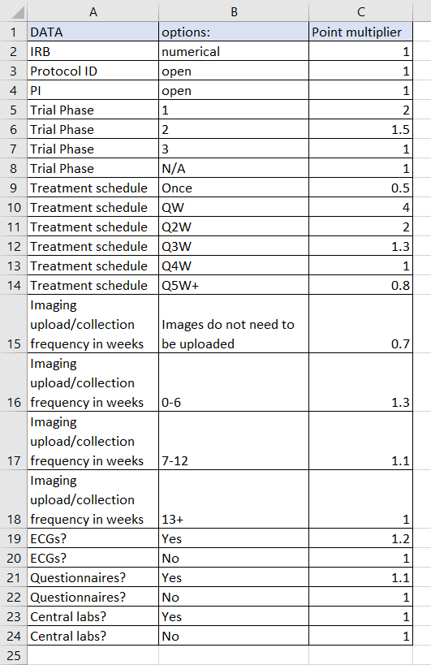

# Clinical Research Workload Manager

## Overview
An Excel-based workload allocation tool designed to help clinical research management teams quantify and balance coordinator workload across clinical trials. This system transforms subjective workload assessment into a consistent and data-driven resource that can highlight heavy workload areas so that employee resources can be allocated as needed to meet institutions clinical trial data needs.

## Business Problem
Clinical research coordinators (CRCs) often manage multiple concurrent trials with varying complexity levels. With the development of a new data core department, management had requested a way to better quantify workload to understand operational capacity and need for additional hires or reallocation of data CRCs to more data intensive teams. Without a quantitative framework, management struggled to:
- Quantify the complexity of a new study and predict how demanding it will be
- Equitably distribute workload across team members
- Identify capacity constraints before burnout occurs
- Make informed hiring and resource allocation decisions 

## Solution
A dynamic workload scoring system that:
1. **Quantifies trial complexity** through standardized criteria (trial phase, treatment schedule, data collection frequency, etc.)
2. **Calculates individual workload metrics** by combining trial complexity scores with patient counts
3. **Provides real-time dashboards** for each coordinator showing total studies, patients, and aggregate workload metric

## Key Features

### 🎯 Individual CRC Dashboards
Personalized workload views displaying:
- Total number of assigned studies
- Total number of patients under management
- **Composite workload metric** (sum of: patients per study × study complexity score)
- Breakdown of all assigned studies and their respective patient counts. The studies assigned in this list will automatically adjust KPIs at the top of the dashboard.

*Example dashboard showing workload breakdown by study with real-time metrics*

### 📝 New Study Criteria Form
Standardized intake form that uses data validation and drop down menus to ensure consistent data capture for all new trials. Submission of this form will automatically add new trial data onto 'Data Study List' sheet, allowing for scalabilty as trial portfolio grows. 

*User-friendly form interface for adding new trials to the system*

### 📊 Data Study List
Centralized repository of all clinical trials with detailed attributes:
- IRB number, protocol ID, and principal investigator
- Trial phase and treatment schedule
- Data collection requirements (imaging frequency, ECGs, questionnaires, lab work)
- Automatically calculated complexity multiplier for each study

*Comprehensive study list with complexity attributes and multiplier calculations*

### ⚙️ Configurable Multiplier Table
Backend scoring engine with adjustable point values for each trial characteristic, allowing the system to adapt to organizational priorities.

*Customizable scoring matrix for trial complexity factors*

## Impact & Results
- **Objective workload visibility**: Replaced subjective assessments with quantifiable weighted metrics based on the expertise of veteran CRCs. 
- **Data-driven staffing decisions**: Enabled management to identify overloaded coordinators, assess need for additional hires, and reassign trials to balance workload or pull data CRC from other disease teams for assistance.
- **Improved resource allocation**: Facilitated equitable distribution of new trial assignments based on current capacity

## Technical Implementation
- **Platform**: Microsoft Excel with VBA macros, data validation, and advanced formulas
- **Data Architecture**: Relational structure linking study attributes to CRC assignments
- **Automation**: Form-based data entry with automatic calculation propagation
- **Scalability**: Supports multiple disease teams and coordinators within single workbook

## Skills Demonstrated
- Healthcare operations analytics
- Data modeling for resource management
- Dashboard design and visualization
- Stakeholder requirements gathering / Clinical research operations expertise
- Process standardization and documentation

##🚀 Future Enhancements
- Automated data ingestion for new studies and CRC assignments from CTMS or EHR exports
- Power BI dashboard version with enhanced visualizations
- Summary reports for each disease team and a cumulative summary accross the department
- Trend analysis for forecasting CRC workload needs

---

*This deidentified version demonstrates the analytical framework while protecting sensitive institutional data.*
